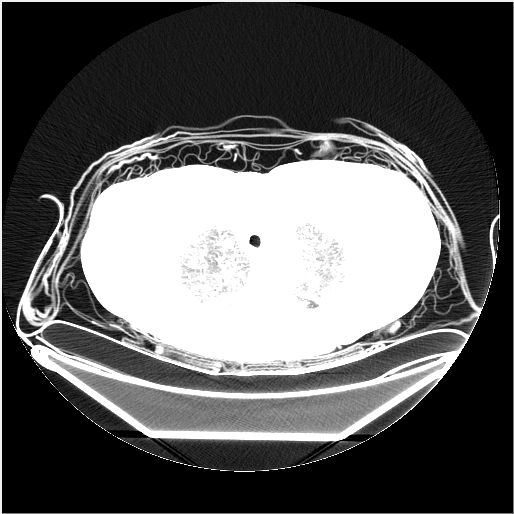
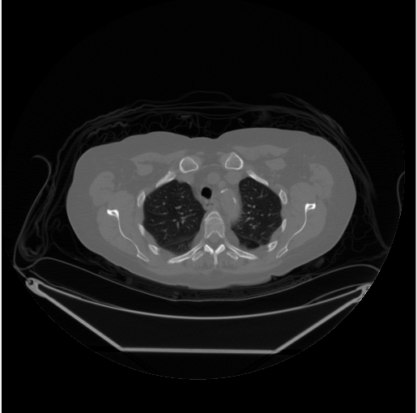
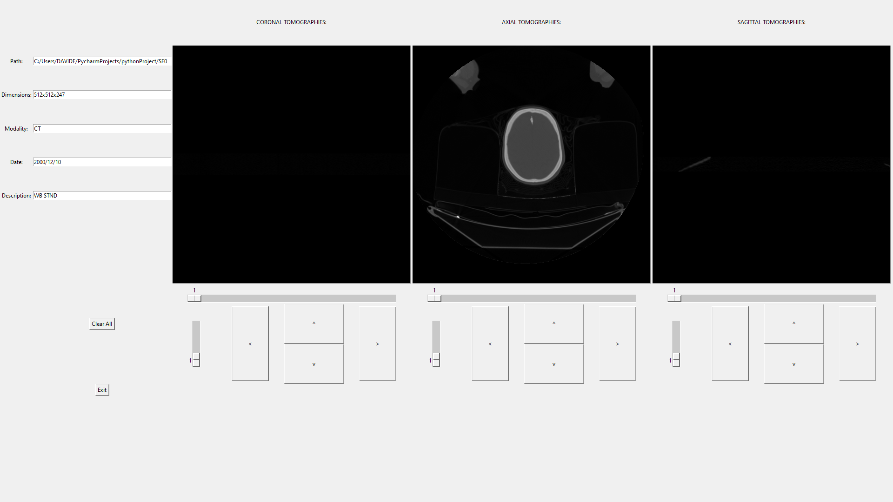
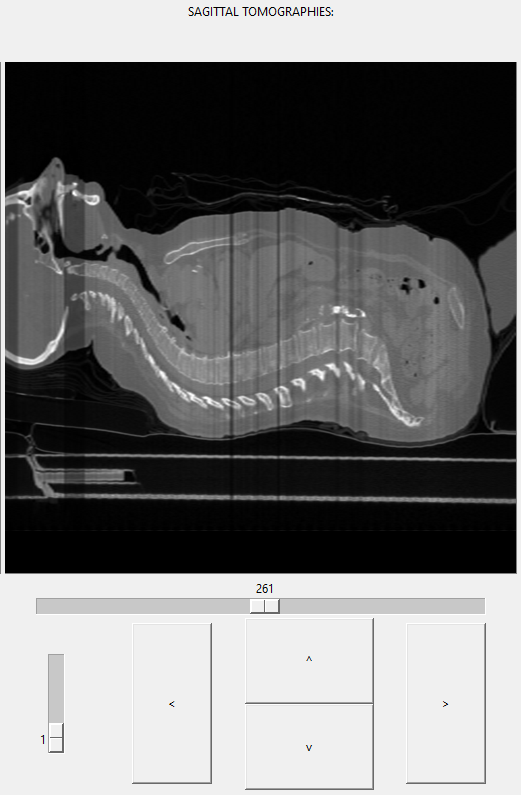
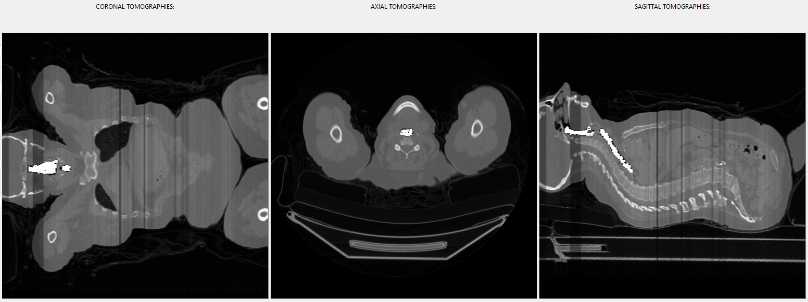

# DICOM visualizer

## Introduction
The DICOM Visualizer project aims to provide an easy and rapid way to access medical images in DICOM format, which is widely used in the medical field. This tool features a Graphic User Interface (GUI) created in Python, allowing users to scroll through tomographies on different planes, zoom in on images, and manually segment areas of interest.

## Main Code

### Directory Selection
Upon starting the application, a dialog window prompts the user to select a directory containing DICOM files (.dcm). The selected directory is scanned, and only .dcm files are processed. If no valid files are found, the user is prompted to retry or exit.

### Dataset Elaboration
The selected DICOM images are analyzed and stored in a 3D array. Images are displayed in 8-bit greyscale, and pixel values are normalized to avoid oversaturation.

<p align="center">  <p/>

*Fig 3. DICOM image*
<p align="center">  <p/>

*Fig 4. DICOM image normalized*

### Tag Extraction and First Screen
DICOM files contain various metadata, such as imaging modality, exam date, and description. This information is displayed on the GUI using Tkinter labels and entries.

<p align="center">  <p/>

*Fig 5. First GUI screen*

## Functionalities

### Slider
Each view has a slider to scroll through the images. The selected image replaces the previous one on the canvas, and interpolation ensures consistent image dimensions.

### Zoom
The zoom functionality allows images to be enlarged up to four times their original size. Directional buttons enable movement across the zoomed image. Zoom and segmentation cannot be performed simultaneously.

<p align="center">  <p/>

*Fig 10. Zoom slider and directional buttons*

### Manual Segmentation
Users can manually segment images by selecting pixels with the mouse. A mask array stores binary values to highlight selected areas. This functionality allows detailed examination of specific regions.

<p align="center">  <p/>
*Fig 11. Manual segmentation of the oropharynx and the tracheobronchial tree*


</br>
</br>

<details>
  <summary>Instructions</summary>

## Requirements
The needed libraries are the following:

* os
* tk == 8.6
* numpy == 1.20.2
* pydicom == 2.1.2
* Pillow == 8.3.2
* scipy == 1.6.2
* opencv-python==4.5.1.48

To install these libraries, execute the command:

```
pip install -r requirements.txt
```

## Visualization
The dimension of the screen could be too small to completely visualize the GUI.
In this case, delete or comment line 21 of DICOMvisualizer.py

</details>
